# flutter_material_widgets

A Flutter project that gives a visual representation of how the new NavigationRail Widget in Flutter works.

# 📸 Screenshots

### The screenshots below are taken on a iOS simulator.

|  ScreenShot 1                                         |  ScreenShot 2                                          |
| ------------------------------------------- | ----------------------------------------- |
|  |  |

|   ScreenShot 3                                           |  ScreenShot 4                                         |
| ------------------------------------------- | ----------------------------------------- |
| 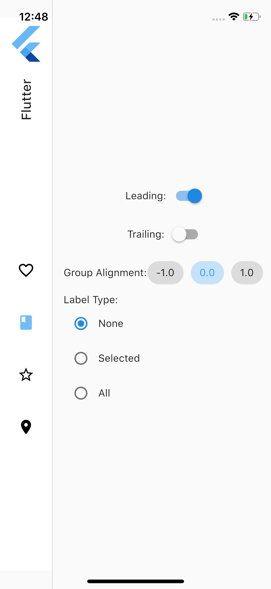 | 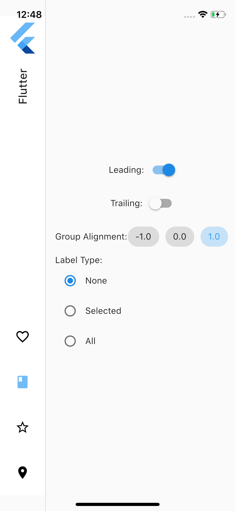 |

|  ScreenShot 5                                          | ScreenShot 6                                          |
| ------------------------------------------- | ----------------------------------------- |
| 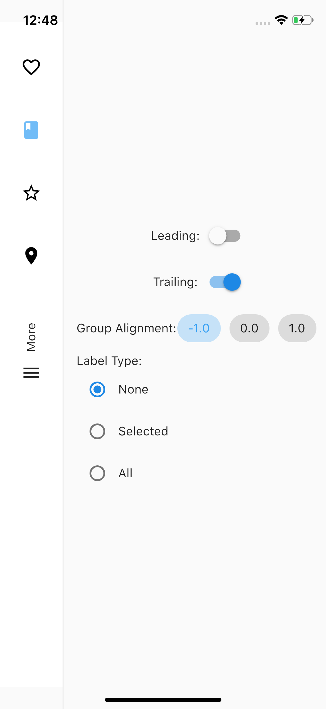 | 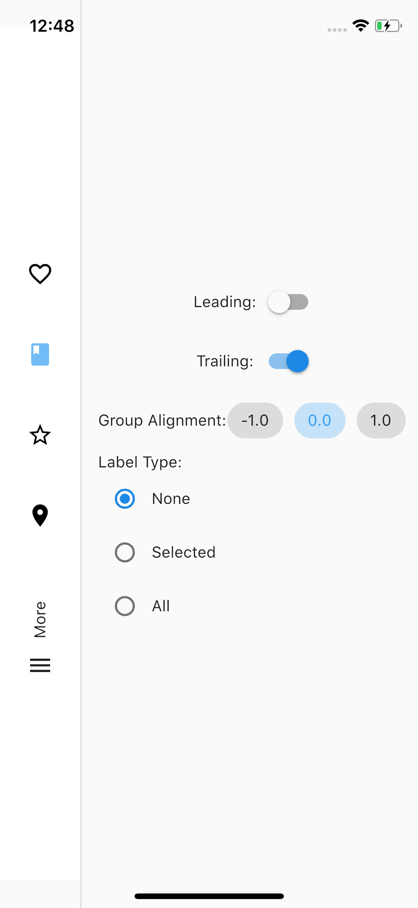 |

|  ScreenShot 7                                            | ScreenShot 8                                       |
| ------------------------------------------- | ----------------------------------------- |
| 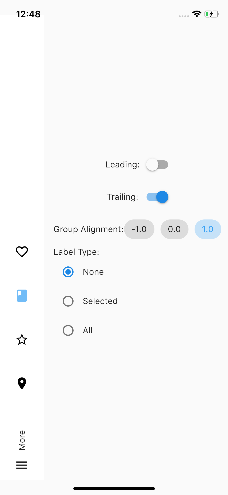 | 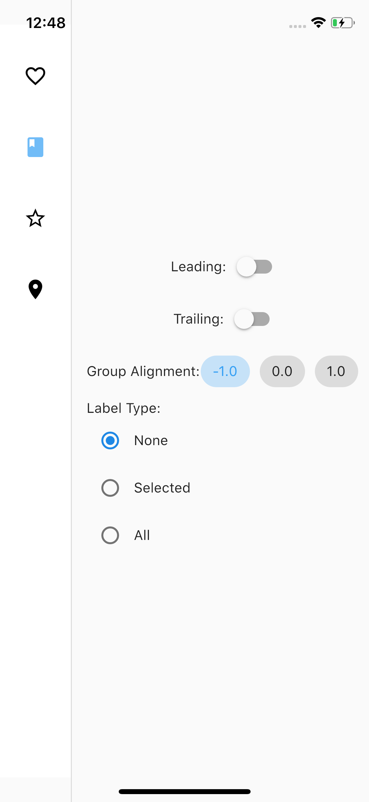 |

| ScreenShot 9                                         | ScreenShot 10                                       |
| ------------------------------------------- | ----------------------------------------- |
| 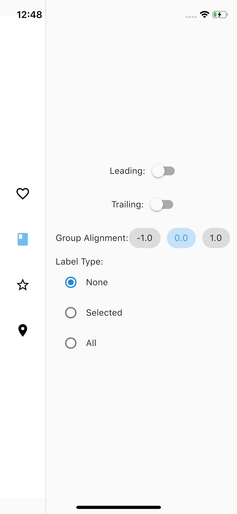 | 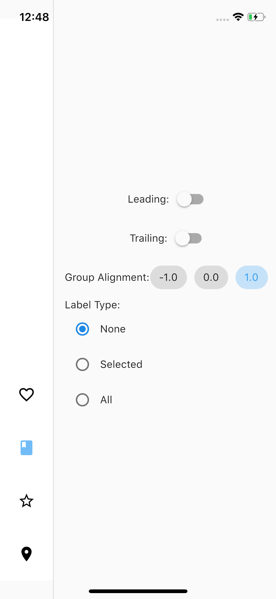 |

|  ScreenShot 11                                          | ScreenShot 12                                           |
| ------------------------------------------- | ----------------------------------------- |
| 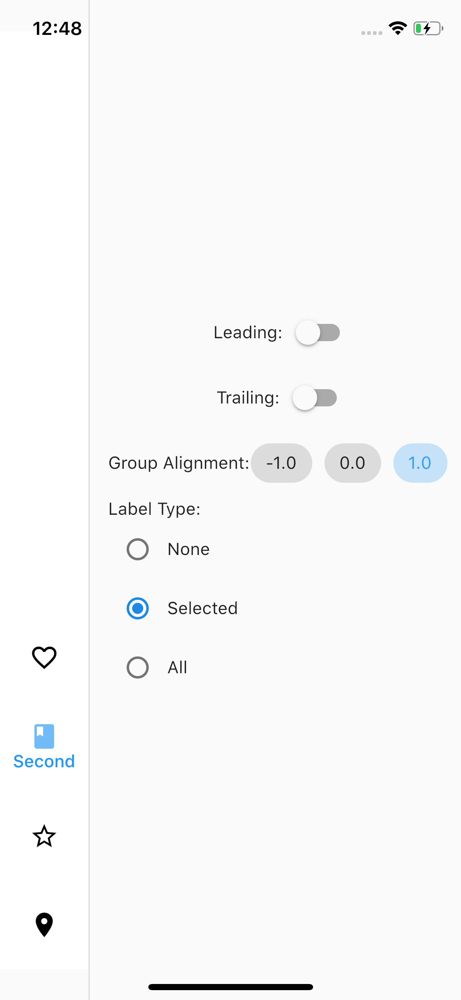 | 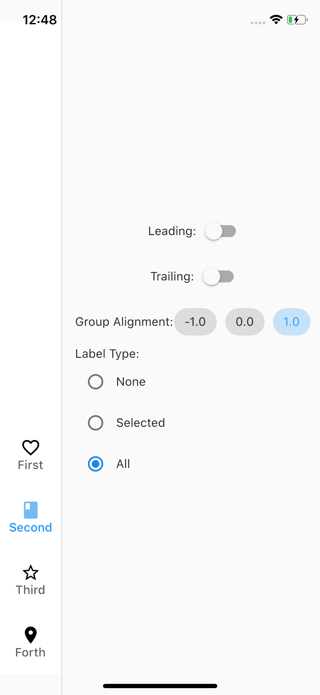 |

| ScreenShot 13                                           | ScreenShot 14                                          |
| ------------------------------------------- | ----------------------------------------- |
| 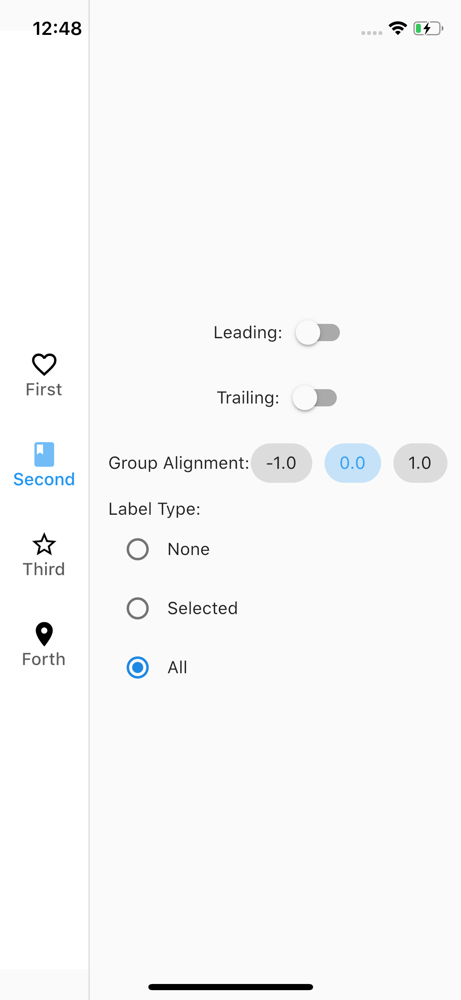 | 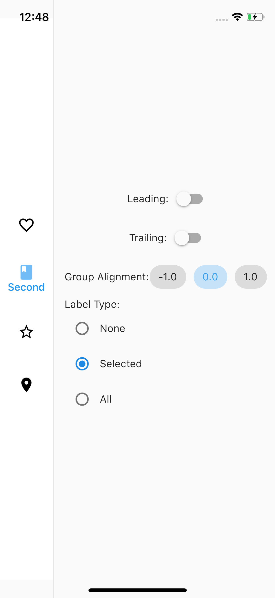 |

|  ScreenShot 15                                           | ScreenShot 16                                          |
| ------------------------------------------- | ----------------------------------------- |
| 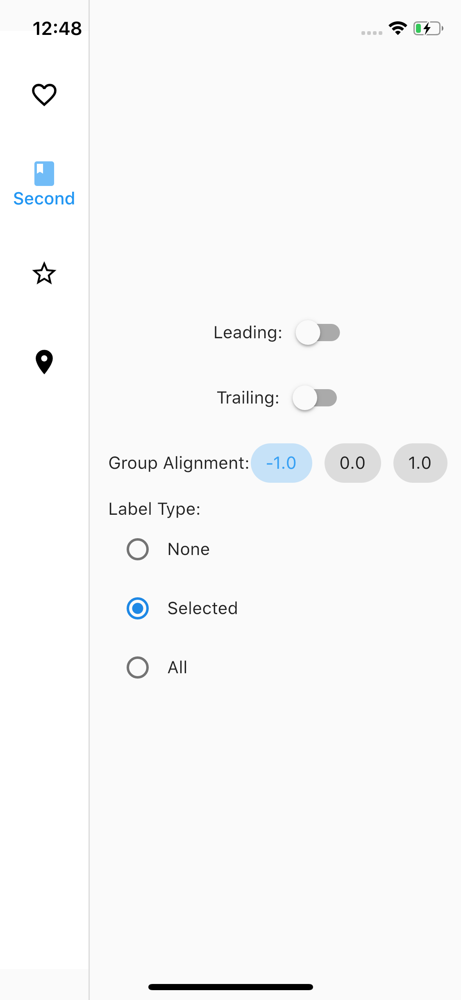 | 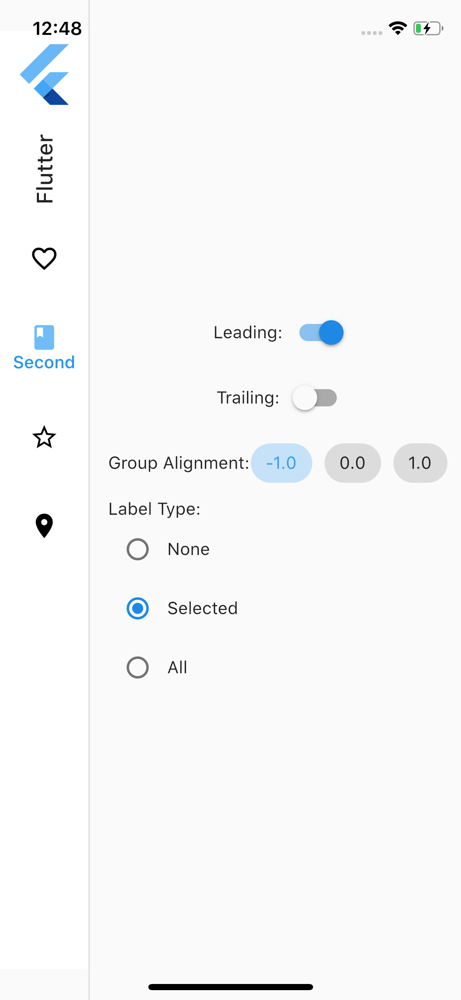 |

| ScreenShot 17                                          | ScreenShot 18                                         |
| ------------------------------------------- | ----------------------------------------- |
| 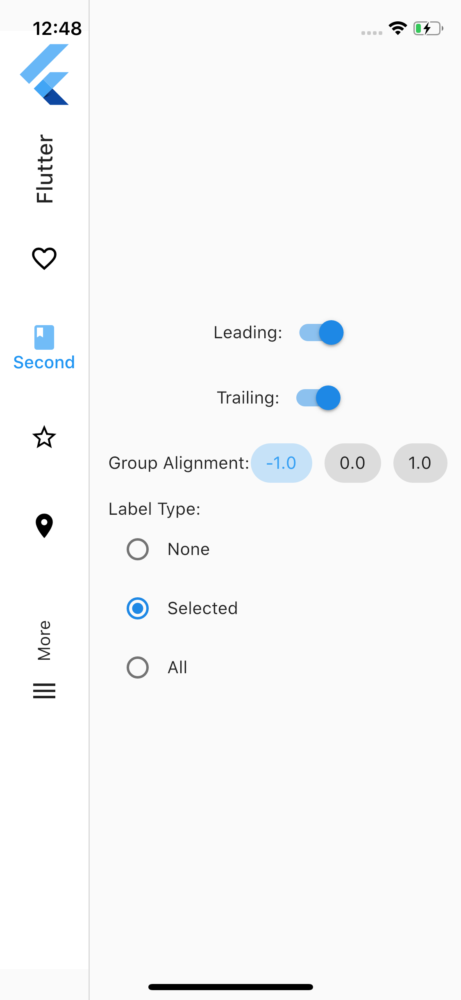 | 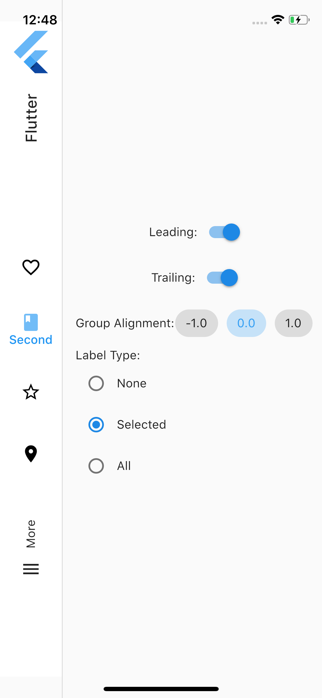 |

|  ScreenShot 19           |        
| ------------------------------------------- |
| 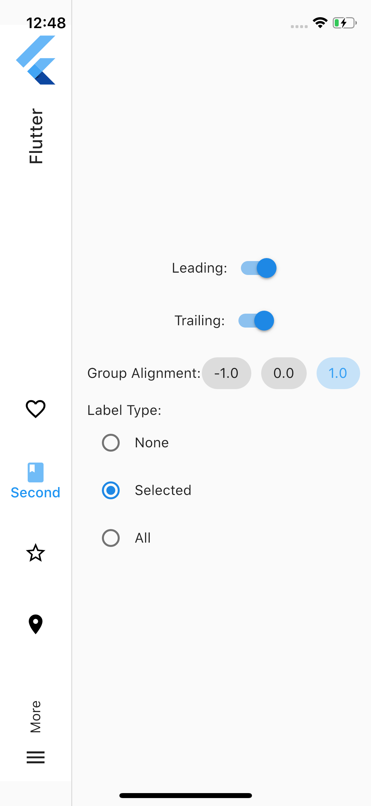 | 

## Getting Started

This project is a starting point for a Flutter application.

A few resources to get you started if this is your first Flutter project:

- [Lab: Write your first Flutter app](https://flutter.dev/docs/get-started/codelab)
- [Cookbook: Useful Flutter samples](https://flutter.dev/docs/cookbook)

For help getting started with Flutter, view our
[online documentation](https://flutter.dev/docs), which offers tutorials,
samples, guidance on mobile development, and a full API reference.
